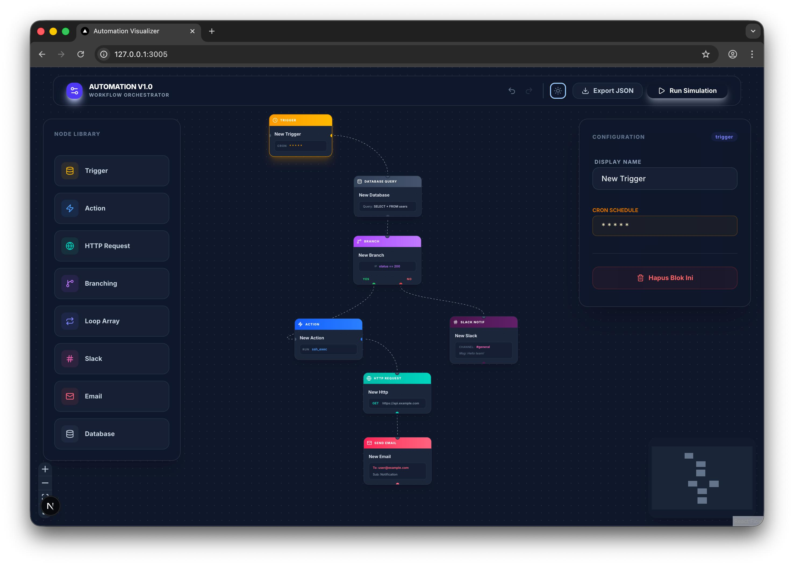
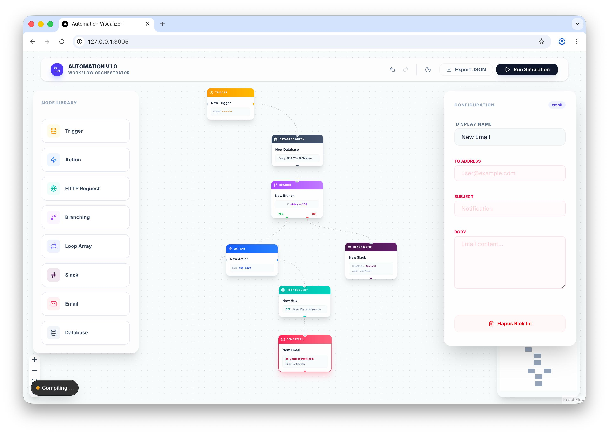

# 🚀 Automation V1.0 - Workflow Orchestrator

Alat orkestrasi alur kerja visual tingkat lanjut untuk membangun logika otomasi kompleks dengan antarmuka modern yang mendukung tema Gelap dan Terang.

**🌐 Live Demo:** [Buka Aplikasi di Vercel](https://automation-flow-visualizer-3n8e-dceag9v36-danifeb94s-projects.vercel.app/)

---

## 👨‍💻 Tentang Pengembang
Saya adalah seorang **Automation Developer** yang telah berkarier sejak November 2016. Proyek ini merefleksikan pengalaman saya selama 9 tahun lebih dalam menangani sistem orkestrasi profesional.

---

## 📸 Pratinjau Antarmuka

Aplikasi ini dilengkapi dengan fitur alih tema (toggle theme) untuk mendukung kenyamanan pengguna di berbagai lingkungan kerja.

### 🌑 Dark Mode (V1.0 Pro)

*Tampilan orkestrasi alur kerja dengan tema gelap yang fokus dan modern.*

---

### ☀️ Light Mode Version

*Tampilan bersih dan cerah untuk visibilitas maksimal di siang hari.*

---

## ✨ Fitur Unggulan (V1.0)

* **Advanced Logic Nodes**: Mendukung **Branching** (IF/ELSE) dan **Loop Array**.
* **Service Integrations**: Node khusus untuk **Slack**, **Email**, dan **Database Query**.
* **Connectivity**: Integrasi API melalui node **HTTP Request**.
* **Dynamic Theme**: Mendukung perpindahan tema Gelap dan Terang secara mulus.
* **JSON Export**: Desain visual yang dapat diekspor menjadi skema data terstruktur.

---

## 🛠 Tech Stack

* **Framework**: Next.js 15+
* **Visual Engine**: React Flow
* **Styling**: Tailwind CSS & Lucide React
* **Deployment**: Vercel

---
*Dikembangkan dengan dedikasi oleh Dani.*