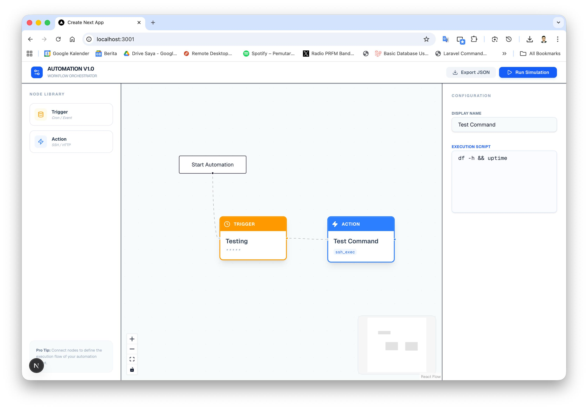

# 🚀 Automation Flow Visualizer

Alat orkestrasi alur kerja (workflow) berbasis web yang interaktif, dirancang untuk menjembatani desain logika visual dengan eksekusi otomasi pada sistem backend.

**🌐 Live Demo:** [automation-flow-visualizer-vercel.app](https://automation-flow-visualizer-3n8e-dceag9v36-danifeb94s-projects.vercel.app/)

---

## 👨‍💻 Dikembangkan oleh Dani
Sebagai seorang **Automation Developer** yang telah berkarier sejak November 2016, saya membangun alat ini untuk menyederhanakan proses orkestrasi alur kerja yang kompleks. Proyek ini merefleksikan pengalaman profesional saya dalam menangani sistem seperti **BMC Atrium Orchestrator** serta latar belakang teknis saya di bidang networking dan scripting.

---

## ✨ Fitur Utama

* **Canvas Interaktif**: Editor visual performa tinggi yang dibangun dengan **React Flow**, memungkinkan penyusunan pipeline otomasi secara mulus.
* **Arsitektur Node Kustom**:
    * **Trigger Nodes**: Blok pemicu berdasarkan waktu (Cron) atau kejadian tertentu (event).
    * **Action Nodes**: Blok eksekusi untuk skrip SSH, perintah shell, atau pemanggilan API.
* **Sinkronisasi Real-time**: **Panel Properti** dinamis yang memperbarui data node secara instan menggunakan manajemen state **Zustand**.
* **Ekspor Siap Produksi**: Fitur "Export to JSON" yang menghasilkan konfigurasi terstruktur yang kompatibel dengan mesin eksekusi backend.
* **Tech Stack Modern**: Dibangun menggunakan **Next.js 15+**, **Tailwind CSS**, dan **Lucide React** untuk antarmuka yang bersih dan profesional.

---

## 🛠 Tech Stack

| Kategori | Teknologi |
| :--- | :--- |
| **Framework** | Next.js 15 (App Router) |
| **Visual Library** | React Flow (@xyflow/react) |
| **State Management** | Zustand |
| **Styling** | Tailwind CSS |
| **Icons** | Lucide React |

---

## 🚀 Cara Menjalankan Proyek Secara Lokal

1.  **Clone repositori**:
    ```bash
    git clone [https://github.com/danifeb94/automation-flow-visualizer.git](https://github.com/danifeb94/automation-flow-visualizer.git)
    ```

2.  **Instal dependensi**:
    ```bash
    npm install
    ```

3.  **Jalankan server pengembangan**:
    ```bash
    npm run dev
    ```

4.  **Akses aplikasi**:
    Buka [http://localhost:3001](http://localhost:3001) di browser Anda.

---

---
## 💡 Mengapa Proyek Ini Dibuat?

Proyek ini merupakan solusi untuk mengotomatiskan tugas-tugas repetitif—yang merupakan minat utama saya sebagai pengembang otomasi. Baik itu mengelola router **OpenWrt**, mengeksekusi perintah **SSH** pada server jarak jauh, atau memantau kesehatan jaringan melalui query data, visualizer ini menyediakan struktur data yang dibutuhkan untuk otomasi yang andal.

---
*Dikembangkan dengan ❤️ oleh Dani.*